**Team Member**: Xin Tong/Yifan Xu/ Longhao Gao

What is it?:
==================================================================================================================

Implementation of three different distributed mutual exclusion protocol, which are Lamport and Roucairol & Carvalho’s and Ricart-Agrawala's.

Also implemented automatic correctness verification and performance evaluation.

Project Requirements:
====================================================================================================================

1.  Two interfaces in SOA manner: enterCS() and leaveCS().

2.  All the nodes in full-mesh topology, only one FIFO connections allowed between each node.

3.  Automatic verification of the algorithm correctness.

4.  Performance needs to be monitored and evaluated.

System Architect
---------------------------------------------------------------------------------------------------------------

The project was designed with Layered architectural style. The
application, algorithm and FIFO channel were decomposed into layers.
Each layer provides interface to upper layer and use the lower layer’s
services.

The bottom layer is the transport layer which provides both TCP and SCTP
connection. In order to provide FIFO for TCP connection, we forced to
flush the TCP buffered each time we send a message.

The Message Service Layer provide not only String based message delivery
to specific node, but also embedded the Logical and Vector clock inside
it. The clock will tick automatically once new messages are sent or
received. The Lock service could be utilized by upper layers.

The algorithm layer is in charge of orchestrate the entering of critical
section. It’s the core part of this project. We implemented three
different types of algorithms.

The application layer is in charge of simulator the behavior of enter
and leaving critical section. Besides, both the correction verification
subsystem and performance measure subsystem located on this layer
because the application layer provides them with all kinds of timer log.

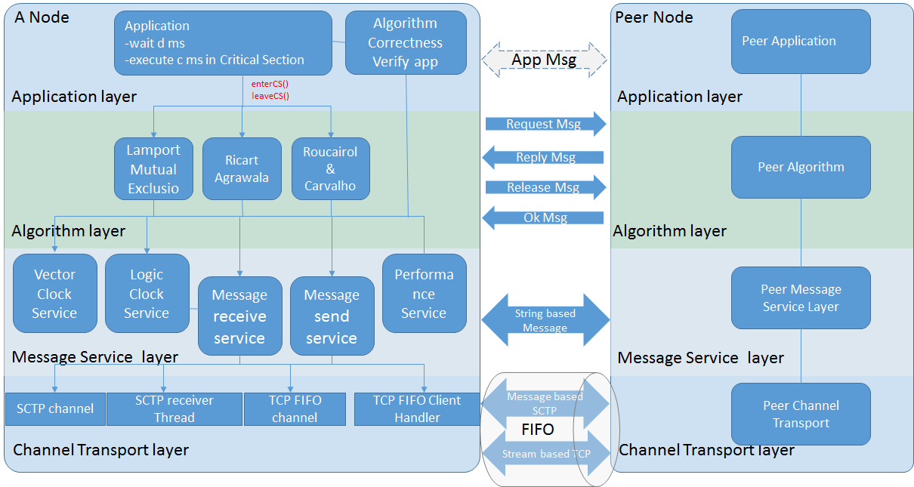

Design Model
-----------------------------------------------------------------------------------------------------------

GRASP (General Responsibility Assignment Software Pattern) is the main
principle we use to create our main classes.

Controller: it’s the entry of the main program, it represents the
overall mutual exclusion system to the outside.

Information expert: Node. Node provides the network topology and config
information to the system. It is generated by the parser class which can
parse the config file.

Creator: MessageFactory & Algorithms Factory create the message and
algorithm as needed.

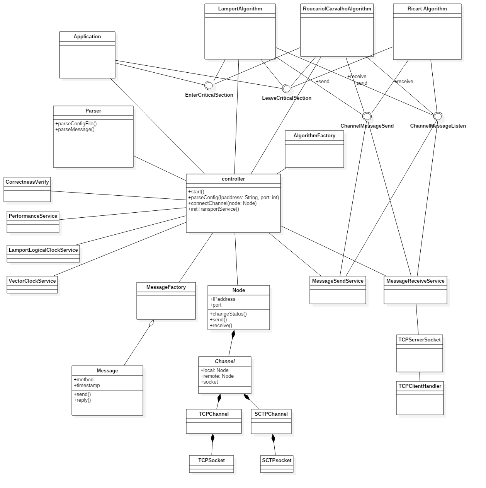

Performance Measurements
-----------------------------------------------------------------------------------------------------------------

### Results varied on different number of nodes

  ---------------------------------------------------------------------------------- --------
  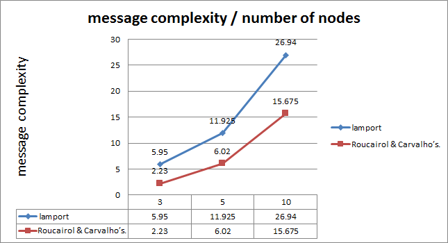   d=20ms
                                                                                     
                                                                                     c=10ms
  ---------------------------------------------------------------------------------- --------

  ------------------------------------------------------------------------ --------
  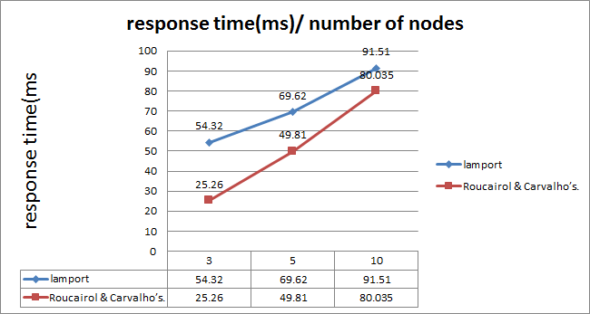   d=20ms
                                                                           
                                                                           c=10ms
  ------------------------------------------------------------------------ --------

  ----------------------------------------------------------------------- --------
  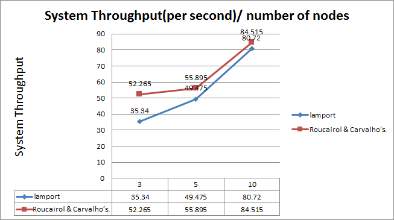   d=20ms
                                                                          
                                                                          c=10ms
  ----------------------------------------------------------------------- --------

### Results varied on different execution times

  ---------------------------------------------------------- -------------
  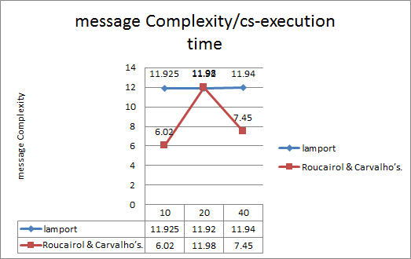   N = 5 nodes
                                                             
                                                             D =20ms
  ---------------------------------------------------------- -------------

  ------------------------------------------------------------------------ -------------
  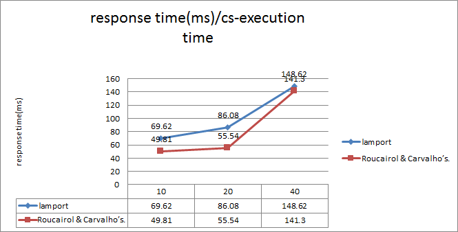   N = 5 nodes
                                                                           
                                                                           D =20ms
  ------------------------------------------------------------------------ -------------

  ---------------------------------------------------------------------------------- -------------
  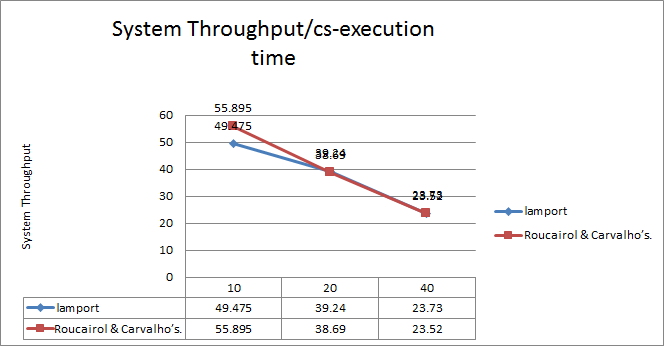   N = 5 nodes
                                                                                     
                                                                                     D =20ms
  ---------------------------------------------------------------------------------- -------------

### 

### Results varied on different delay in execution

  -------------------------------------------------------------------- ------------
  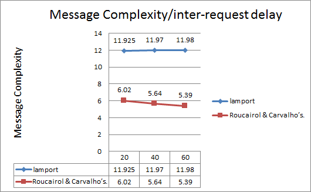   n= 5 nodes
                                                                       
                                                                       c= 10 ms
  -------------------------------------------------------------------- ------------

  ------------------------------------------------------------------------ ------------
  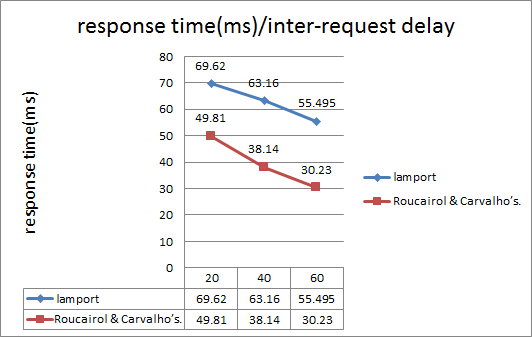   n= 5 nodes
                                                                           
                                                                           c= 10 ms
  ------------------------------------------------------------------------ ------------

  ----------------------------------------------------------------------------------- ------------
  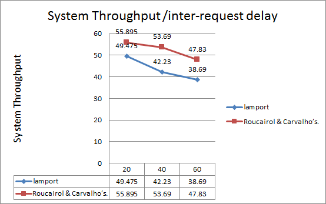   n= 5 nodes
                                                                                      
                                                                                      c= 10 ms
  ----------------------------------------------------------------------------------- ------------
